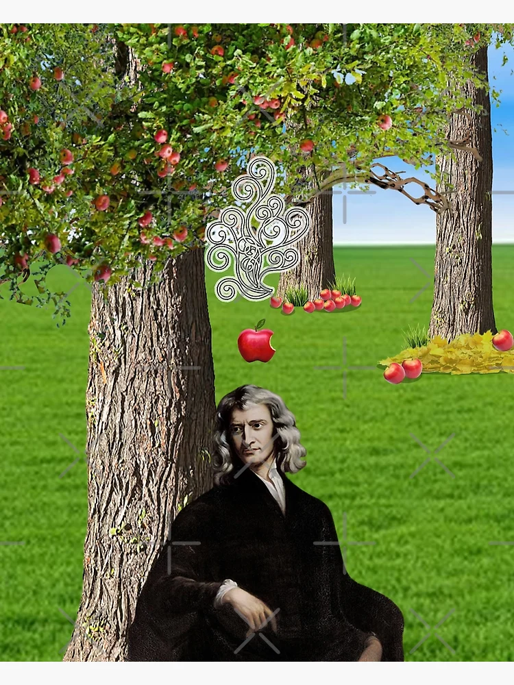
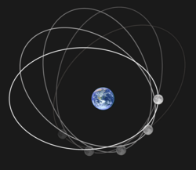
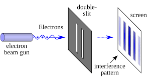
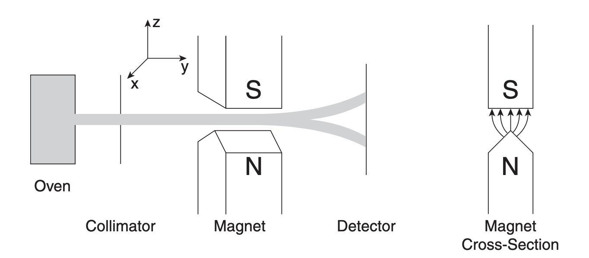
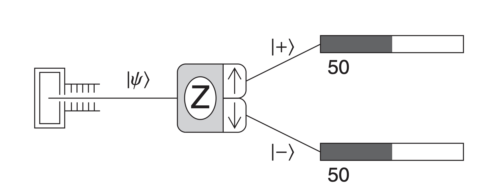

# Introduction

## Particle Theory of Light

As you might expect, every physics story begins with the GOAT himself, *Sir Isaac Newton*.

> “Every body continues in its state of rest, or of uniform motion in a right line unless it is compelled to change that state by forces impressed upon it.” -- Issac Newton

Newton built a set of equations that could predict how almost everything moves.  An apple falls straight from the tree.  A satellite traces an ellipse around a planet:

$$
F_{\text{gravity}} = M_{\text{apple}} * g 
$$

$$
F_{\text{gravity}} = \frac{G M_{\text{earth}} M_{\text{moon}}}{r^2} ,
\quad 
r(\theta) = \frac{a(1 - e^2)}{1 + e \cos\theta} 
$$

::: {.columns}
::: {.column width="50%"}

:::

::: {.column width="50%"}

:::
:::

From apples to planets — one law that rules all.

These laws convinced people that an apple is no different from a planet.  If you know an object's position $x$ and momentum $p=mv$ at a given time, and you know the forces acting on it, you can predict everything about its future.  This idea takes shape mathematically in Hamiltonian mechanics:

$$
\frac{dx}{dt}=\frac{\partial H}{\partial p},
\quad
\frac{dp}{dt}=-\frac{\partial H}{\partial x}
$$

If the same laws work for big things like apples and even larger ones like planets, why not for small things—like light?  Newton proposed that light was made of tiny, fast-moving particles he called *corpuscles*.

At the time, this view made perfect sense:

- Light travels in straight lines.  
- Reflection and refraction can be explained if these particles “bounce” or “slow down” when entering a new medium.  
- Bro was(is) famous. 

For decades, the corpuscular theory ruled physics largely because Newton’s name carried enormous weight.

> “Nature is very consonant and conformable with herself.” -- Issac Newton

## The Double-Slit Experiment

In 1801, *Thomas Young* performed the double-slit experiment. Light passed through two narrow slits and formed alternating bright and dark bands —  an interference pattern that only waves can produce.

{fig-align="center"}

You’ve probably seen this picture before — somewhere, sometime. The idea of a *wave* isn’t something that comes naturally to us. It’s hard to accept that something invisible can bend, overlap, and cancel itself out. But we’ll leave that mystery for another day.

By the mid-19th century, *James Clerk Maxwell* took the idea further, showing that light is an electromagnetic wave.

The corpuscular theory was dead.  
More than ever, people were convinced that light was a wave.

> “Happy is the man who can recognize in the work of to-day a connected portion of the work of life and an embodiment of the work of Eternity.” -- James Clerk Maxwell

## Photoelectric

It was 1905, a not-so-well-known German young man published four papers in quick succession on the *Annalen der Physik*. These articles turned out to be great great works, changing physics forever. One of them, on the photoelectric effect, would later earn him the Nobel Prize.

The photoelectric paper marked the beginning of quantum physics. According to our *wave explanation of light*, when you shine light on a piece of metal, electrons jump out. That much was known. Classical physics said the energy of these electrons should rise with the brightness of the light. Brighter beam, stronger electrons. Wait long enough, and even very dim light should eventually free them.

But that’s not what the experiments showed.

He suggested that light does not always behave like a smooth wave. Instead, it comes in discrete packets of energy, each packet carrying an amount of:

$$
E = h\nu 
$$

where $h$ is Planck’s constant and $\nu$ is the frequency of the light.

With this idea, the photoelectric puzzle becomes simple arithmetic. An electron absorbs a single light quantum of energy $h\nu$. Some of that energy is needed just to escape the metal, a cost called the work function $\phi$. Whatever is left shows up as the kinetic energy of the electron:

$$
E_k = h\nu - \phi 
$$

Three consequences follow immediately:

- If $h\nu < \phi$, no electron can escape, no matter how bright the light is.
- Once $h\nu > \phi$, electrons are emitted instantly without delay.
- The kinetic energy grows linearly with frequency $\nu$, but does not depend on the light’s intensity.

This matched experiment. The math was undeniable. It challenged the idea that light was a wave. The picture of light was no longer simple.

His other three papers of 1905 were just as powerful: Brownian motion, the theory of special relativity, and the equation $E = mc^2$.His name, of course, is Albert Einstein.

Special relativity looks simple. Too simple. The math is so clean you wonder why it took three centuries after Newton for anyone to see the cracks. General relativity was another matter. It was harder, deeper, and it consumed Einstein twenty years after 1905 to bring it to life.

By the 1930s, his attention had shifted again. This time to quantum mechanics, a theory he had helped to start but never fully trusted.

> “The distinction between past, present and future is only a stubbornly persistent illusion.” -- Albert Einstein

# Introduction to the Language of Quantum Mechanics

We will get back to Einstein soon. But first, let’s see what others built in quantum theory during the twenty years of his absence.

Here, I’ll introduce the notations we use to describe calculations in quantum mechanics. You’ll see some new symbols, some strange Greek letters. They might look intimidating, but they are the key to understanding what quantum mechanics is really about. None of these operators are mathematically deep — they are just new symbols, a new language.

It’s fine if you want to skip this section.  
I’ll make sure the math doesn’t block the story,  
but I strongly recommend reading through it anyway.  
Learning this small bit of language will make everything that follows much clearer.

You see, I grew up listening to science podcasts and reading popular books about science. Those are what first pulled me toward the study of physics. But to be honest, none of them ever really explained the quantum world well. Without these notations, it’s almost impossible to see what’s actually happening.

So if you’ve decided to learn a little of the language of quantum mechanics,  let’s start with the simplest experiment we can build — one that shows how strange and beautiful this world really is.

## Stern-Gerlach Experiment – The State of a Quantum System

In 1922, *Otto Stern* and *Walther Gerlach* ran an experiment that quietly rewrote our idea of matter. They fired a beam of silver atoms through a region of space where the magnetic field changed from one point to another, as shown below. Each atom carried a magnetic moment $\boldsymbol{\mu}$, like a tiny bar magnet.

According to classical physics, the interaction energy between the magnetic moment and the magnetic field should be

$$
E = -\boldsymbol{\mu} \cdot \mathbf{B},
$$

and the resulting force should be

$$
\mathbf{F} = \nabla (\boldsymbol{\mu} \cdot \mathbf{B}).
$$

Stern–Gerlach experiment measuring the spin component of neutral particles along the z-axis. The magnet cross section on the right shows the inhomogeneous magnetic field used in the experiment.

If atoms behaved like classical magnets, the beam should spread out continuously on the detector. Each atom’s magnetic moment could point in any direction, so the screen should show a smooth blur of impacts — some deflected strongly upward, some barely moved at all.

But when Stern and Gerlach looked, they saw something else.  The beam didn’t smear into a streak. It split into two sharp spots —  one up, one down. No atoms in between.

The actual result of Stern–Gerlach experiment. The particles only has two options: spin up (represented by $|+\rangle$) or spin down ($|-\rangle$).

That simple pattern broke the logic of classical physics.  It meant the magnetic moment of each atom could only take two orientations relative to the magnetic field. No middle ground.  Nature, it seemed, worked in jumps, not slides.

The above might sound like a lot of physics, so here’s what’s happening in plain words:

- Atoms naturally spin.
- Here we only care about the spin along the z-axis — imagine a basketball spinning on your fingertip.
- When an atom enters the device, its spin interacts with the magnetic field.
- Classically, we should get every possible spin direction — fast, slow, tilted.
- Instead, we get only two results: spin straight up or spin straight down.

In classical physics, if something has a property, it simply has it.  Color is a property like that. If your car is red, every photo and every friend will say it’s red.  It is what it looks like.

But in the Stern–Gerlach experiment, a single atom can have two possible “colors” of spin.  It’s like saying the same car could be red or green at the same time.

Sure, if you look directly at your car, you know which one it is — red or green.  But if you mix a trillion cars together and stand far away, you can’t tell what dominates.

In one typical Stern–Gerlach run, around $10^{14}$ to $10^{15}$ atoms fly through the apparatus, that's 1000000000000000 cars — hundreds of trillions of tiny magnets, all spinning, all following the same invisible rule.That’s the story of these atoms. Each one behaves the same way, but collectively they reveal a strange kind of order in their randomness.

To describe this new kind of behavior, physicists needed a new kind of mathematics.  In quantum mechanics, the state of a system isn’t defined by a simple number or coordinate, but by a *state vector*, written as

$$
|\psi\rangle
$$

> “The state of a quantum mechanical system, including all the information you can know about it, is represented mathematically by a normalized ket $|\psi\rangle$.”

## Bra and ket

## Superposition

For a spin-$\tfrac{1}{2}$ particle, like the silver atom in the Stern–Gerlach experiment, there are only two basic states:

$$
|+\rangle \quad \text{and} \quad |-\rangle 
$$

which represent spin “up” and spin “down” along the $z$-axis.

A general quantum state can be a mixture — a *superposition* — of both:

$$
|\psi\rangle = \alpha |+\rangle + \beta |-\rangle 
$$

where $\alpha$ and $\beta$ are complex numbers called *probability amplitudes*.  The total probability must always add up to one:

$$
|\alpha|^2 + |\beta|^2 = 1 
$$

## Measurement

When we perform a measurement (by sending the atoms through the magnetic field again), the result is random but follows these probabilities:

$$
P(+) = |\alpha|^2, \quad P(-) = |\beta|^2
$$

Each atom is found either spin-up or spin-down — never both — but before measurement, it carries both possibilities in its state vector.

To make calculations cleaner, quantum mechanics uses two related symbols: the *ket* $|\psi\rangle$ and the *bra* $\langle\psi|$. Together, they form the *bra–ket* notation:

$$
\langle \psi | \psi \rangle = 1 
$$

The bra $\langle\psi|$ is the complex conjugate transpose of the ket $|\psi\rangle$, and the quantity $\langle \phi | \psi \rangle$ represents the overlap — or “similarity” — between two states. In the Stern–Gerlach case,

$$
|\langle + | \psi \rangle|^2 = |\alpha|^2, \quad |\langle - | \psi \rangle|^2 = |\beta|^2
$$

This new language allowed physicists to talk about probability and measurement in a world where outcomes are not fixed until observed.  Each atom carries both paths, both futures, until the experimenter looks.

## Entanglement

A few years later, Einstein would take this idea one step further.  He wondered what would happen if two particles shared the same quantum state, even when separated by distance.  That question became the heart of the Einstein–Podolsky–Rosen paradox.

# Einstein–Podolsky–Rosen paradox

# Bell Inequality

# Hidden Variable Theory

# Schrödinger's Cat
