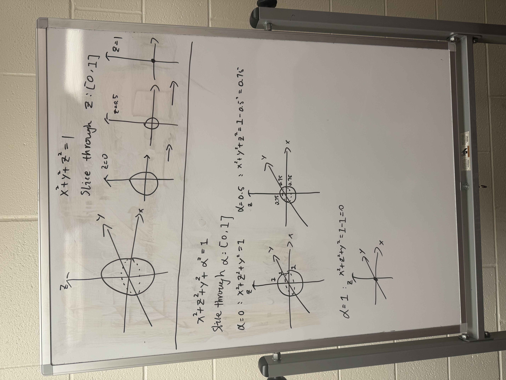

# Overview

Two years ago, I encountered a puzzle game on Steam called [*Viewfinder*](https://store.steampowered.com/app/1382070/Viewfinder/). At the time, it was in beta testing, and I signed up to try a preview section. I was immediately struck by how conceptually innovative it felt. The game is a first-person, 3D puzzle-solving experience, but what makes it unique is its central mechanic: the player can place two-dimensional photographs into a three-dimensional environment, and those images become physically interactive. A flat picture of a staircase, for example, can be positioned in space and transformed into a walkable 3D structure.

As a physics student, I have always been fascinated by dimensions. In mathematics, we begin with one-dimensional objects, such as lines. Two-dimensional objects, like squares or circles, exist on an x–y plane and have area but no volume. Our physical world, by contrast, is three-dimensional: objects have length, width, and height. A building, for instance, exists in three-dimensional space. However, when we take a photograph of it with a phone, the result is only two-dimensional—a flat projection capturing one surface of the object.

This relationship between dimensions has always intrigued me. A two-dimensional observer can only perceive a slice or projection of a three-dimensional object. Extending that idea further, we might ask: how would a three-dimensional observer perceive a four-dimensional space? While we cannot directly see a fourth spatial dimension, mathematics suggests that what we experience would be a three-dimensional “slice” of a higher-dimensional structure.

Inspired by *Viewfinder*, my proposed game builds on this dimensional concept. Instead of transforming 2D images into 3D environments, my game allows the player to shift through different three-dimensional slices of a four-dimensional space. By moving along a fourth spatial axis, the player changes which objects intersect their current 3D reality. Walls may disappear. Separate rooms may merge. Structures may appear or dissolve depending on the slice selected.

# Genre

Platformer. First-person. Single-player.  
The game mainly focuses on solving spatial and dimensional puzzles.

# Mechanism

One of the biggest challenges of this game is helping players understand what it means to move through a four-dimensional space. Since we live in a three-dimensional world, we cannot directly see a fourth spatial dimension. So the game needs to explain the idea in a simple way.

To understand this, we can start with a basic example.

Imagine a ball (a sphere) in three-dimensional space. If we slice the ball with a flat surface, we will see a circle. If we slice through the middle of the ball, the circle will be large. If we move the slice upward, the circle becomes smaller. Eventually, it disappears.

This means that what we see depends on where we cut the object.

My game uses the same idea, but one dimension higher.

Instead of slicing a 3D object into 2D shapes, the player slices a 4D object into 3D spaces. The world in the game is actually part of a larger four-dimensional structure. What the player sees is only one “slice” of that structure.

The player has a device that allows them to move along the fourth spatial axis. When they shift along this axis, the 3D world changes.

For example:

- In one slice, a room might be small.  
- In another slice, the same room might be bigger.  
- In another slice, the shape of the room might be different.  
- A wall might exist in one slice but disappear in another.  

All of these versions come from the same four-dimensional space. The player is not creating new rooms. They are just moving through different cross-sections of the same structure.

The important part is that the player cannot see the full four-dimensional shape. They can only see their current slice. This means they have to experiment. They move between slices, observe how the environment changes, and slowly build an understanding of the larger structure.

If the player is good at imagining geometry, they may start to predict which slice will help them reach a goal. In this way, the game rewards spatial thinking and logical reasoning.

At its most basic level, the mechanic is about manipulating the environment. But in reality, the player is not changing the world. They are changing their position within a higher-dimensional space.

# Storyline and Goals

The main character is a pioneer engineer working for a private company that invented a device capable of shifting through a fourth spatial dimension. The company has built a laboratory designed to test this new technology. The player is the first human to use the device in real experiments.

At the beginning of the game, everything appears stable. The lab is controlled, and the puzzles are intentionally designed to test the device. The goal is simple: use dimensional shifting to solve spatial problems and reach designated checkpoints.

For example, the player may stand in a room separated by glass from another room that contains a button. In the current slice, the rooms are disconnected. However, if the player shifts along the fourth axis, they may enter a slice where the two rooms are connected. In that slice, the player can walk across and press the button.

However, the game introduces a new mechanic: a “chaos level” or “reality instability level.”

Every time the player uses the device to change slices, this instability increases. At first, the effect is small and barely noticeable. As the game continues, the environment begins to show signs of damage:

- Geometry becomes slightly misaligned.  
- Objects flicker between slices.  
- Platforms shift unpredictably.  
- Structural elements appear distorted.  

The more the device is used, the more unstable reality becomes.

In the second half of the game, the instability reaches a breaking point. One dimensional shift takes the player into a space that is no longer part of the laboratory. This new environment feels unfamiliar and uncontrolled.

Near the end of the game, the player encounters something unexpected: in one slice, they see themselves. This suggests that reality has become so unstable that time is no longer strictly linear. Different time states begin to overlap.

The ending concept is that the uncontrolled use of the device has fractured reality. By solving the final sequence of reversed or mirrored puzzles, the player may find a way to stabilize reality and prevent total collapse.

# Animation Style

The animation style should be simple and clean. It does not need to be highly realistic, but it should clearly present a three-dimensional space. The visual design would be similar to games like *Viewfinder* or *Portal 2*: smooth surfaces, clear geometry, and easy-to-read environments.

Clarity is important because the game focuses on spatial thinking. As instability increases, small distortions, misaligned walls, or overlapping geometry from different slices may appear. However, the style should always remain readable.

## Example Visual Effect

::: columns

::: column
{width=100%}
:::

::: column
{width=100%}
:::
:::

::: columns

::: column
{width=100%}
:::

::: column
{width=100%}
:::
:::

::: columns
::: column
{width=100%}
:::

::: column
{width=100%}
:::

:::

# Physics System

A strong physics engine is a key part of this game. Objects must respond naturally to gravity, momentum, and collision.

For example, imagine there is a button on the ceiling. In one slice, gravity works normally. The player places a block below the button. Then the player shifts to another slice where gravity is reversed. The block falls upward and hits the button.

Later stages may include:

- Different gravity directions in different slices  
- Different object weight across slices  
- Objects existing only in certain slices  

This is the goal of the physics system. You can see the gracity is applied to interactive objects:

<iframe width="732" height="411" src="https://www.youtube.com/embed/3tJjRlOxpU8" title="Aperture Genesis - Repulsion Gel" frameborder="0" allow="accelerometer; autoplay; clipboard-write; encrypted-media; gyroscope; picture-in-picture; web-share" referrerpolicy="strict-origin-when-cross-origin" allowfullscreen></iframe>

# Character and NPCs

The main character is a pioneer engineer testing the dimensional device. The game does not require many NPCs. 

Or like many other games, we can add a floating AI assistant robot that hangs around us all the time. That’s just a lame and lazy way to create interaction. Maybe there is a more integrated or smarter way to do that, but I haven’t come up with any yet, so yeah, that’s it for now.

# Music and Sound Design

The music should not feel creepy or uncomfortable. In my opinion, the music in *Portal 2* creates a strange and unsettling feeling, which matches its theme of AI control and system destruction.

However, my game focuses more on exploration and scientific curiosity. The early music should be calm and simple, using light electronic or ambient sounds.

The sound design reflects the instability of reality without turning the game into a horror experience.