---
title: "Problem A: Space Station Air Evacuation Time"
date: 11 28, 2024
toc: true
toc-depth: 3
number-sections: true
categories: [UPhysics Competition]
format:
  html:
    html-math-method: mathjax
    code-fold: false
    code-tools: false

---

::: {.callout-note}
This paper was written for the 2024 [University Physics Competition](https://www.uphysicsc.com/). The original document was prepared in LaTeX and has been adapted into Quarto for this website, so formatting differences may appear.

For the best layout and formatting, please refer to the original PDF version.

**PDF version:** [Download](main.pdf)
:::


## Abstract

In this paper, we explore the behavior of a space station struck with a small meteoroid as air leaks out through the hole. The space station is a cylindrical tube with a volume of about 630 cubic meters, with a hole in the center of one end. The main question is to find how long it will take for the atmosphere inside the station to reduce from 1 to 0.3 atmospheres for various hole diameters. Because the hole is small, airflow is restricted by how much it can compress to squeeze through. The pressure inside the station also decreases as air leaks out, limiting the airflow even more. We found a good formula that links these factors; we figured out how long it would take for any specific hole diameter. In order to solve this, though, we need to include a $Cd$ constant, which varies based on hole size and shape. After finding that, we plug it into our model and find that for a hole with a diameter of 1 centimeter, the atmosphere is reduced to 0.3 in 10 hours and 15 minutes. It took quite a long time, but considering the size of the hole and the sheer volume of air, it makes sense. Looking at other sized holes, we can see that as the diameter increases, the time to 0.3 atmospheres decreases dramatically, with 2 centimeters reaching 0.3 at 2 hours and 33 minutes. There is a large difference of only 1 centimeter. No matter what, having a hole in your space station is certainly serious, but not immediately life-threatening. It is essential to locate and repair the breach within the next few hours before it is too late.

## Notations Used

| Parameter | Meaning | Numerical Value |
|---|---|---|
| $t$ | Time | $-s$ |
| $\rho_0$ | Initial Density Inside | $1.2 kg/ m^3$ |
| $\rho$ | Actual Density Inside | $-kg/ m^3$ |
| $P_0$ | Initial Pressure Inside | $101.3 kPa$ |
| $P$ | Actual Pressure Inside | $-kPa$ |
| $m_0$ | Initial Mass of Air Inside | $948.4kg$ |
| $m$ | Actual Mass of Air Inside | $-kg$ |
| $T$ | Temperature Inside | $-K$ |
| $V$ | Volume of Spaceship | $790.4 m^3$ |
| $A$ | Area of Hole | $-m^2$ |
| $M$ | Mach Number | - dimensionless |
| $C_d$ | Discharge Coefficient | - dimensionless |
| $M_o$ | Molar Mass of Air | $0.029kg/mol$ |
| $R$ | Molar Gas Constant | $8.3 J/mol\cdot k$ |
| $c$ | Speed of Sound | $0.34 km/s$ |
| $C_p$ | Specific Heat at Constant Pressure | $-J/kg\cdot K$ |
| $C_v$ | Specific Heat at Constant Volume | $-J/kg\cdot K$ |
| $v$ | Speed of Flow in (near) the Hole | $-m/s$ |
| $n$ | Amount of Molecules | - dimensionless |
| $k_B$ | Boltzmann constant | $1.4\cdot 10^{-23} m^2kg/s^2K$ |

In the table above, $\rho_0$, $M_o$, $R$, $c$ and $k_B$ are acquired from basic scientific observation.

$P_0$, $M_0$ and $V$ are calculated using basic physics equations. We will not dig into the measurement of those constants.

## Introduction

### Background

Orbital debris is one of the threatening factors in spacecraft, satellites, and astronauts. Colliding with a meteoroid may damage spacecraft and even cause a breakdown. Even a one-centimeter paint lick has the same power as a five hundred-and-fifty pounds object with sixty miles per hour on Earth\cite{NASA2024}.

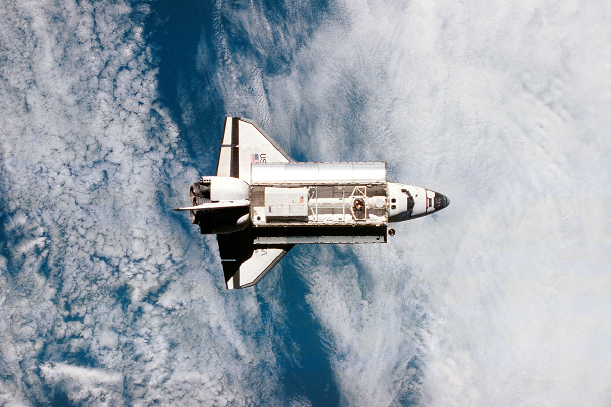{fig-alt="Picture of Space Shuttle Atlantis" width="55%"}

*Figure: Picture of Space Shuttle Atlantis\cite{KennedySpaceCenter-2024}.*

In the event of a meteoroid impact, a small hole in the hull is created, and air begins to leak out. In this study, we aim to estimate the time required for significant pressure loss and investigate the impact of varying hole diameters on the air leakage rate. These idealized flow systems serve as crucial models for evaluating and comparing real-world flow scenarios, offering solutions with sufficient accuracy for numerous engineering applications—our investigation centers on isentropic flow. Isentropic flow is a reversible adiabatic process where no heat transfer occurs, and entropy remains constant \cite{partington-1954}. The flow closely approximates isentropic conditions when the opening is smooth and frictionless. Understanding these patterns helps astronauts escape and estimate the available time before critical pressure levels are reached during an emergency.

### Problem Restatement

The exact wording of the problem is as follows:

> "A space station is approximately shaped like a cylinder with an interior length of 50 meters and a diameter of 4 meters. The air inside the space station is at a temperature of 20 C and a pressure of 1 atmosphere (101.3 kPa). A meteoroid makes a hole 1 cm in diameter in the center of one end of the space station. How much time would it take until the air pressure in the space station was only 0.3 atmosphere? How would this time be different for holes of different diameters?"

To answer this problem, we have to provide the time it would take for the pressure inside to reduce from 1 to 0.3 atmospheres, with holes of differing diameters.

The key points we need to consider are how pressure impacts the rate at which air escapes, turbulence from air escaping, and how much the size of the hole restricts airflow.

## Model

There are many differences between outer space and inside the station, which can affect the air leak differently. However, we know that the movement of air, which is some particles with mass, is caused by some forces. The air pressure is the only variable related to internal force in our spaceship system. So, the $\Delta P$ is the only thing we are truly concerned with; anything else does not truly matter as long as they do not affect our measurement for $\Delta P$. We will explain what we assumed about $P$ and $T$ below.

To simplify the model, a discharge coefficient (\( C_d \)) is included to evaluate all other fluid dynamic effects like compression and turbulence. This coefficient allows us to account for the complex interactions within the system without adding unnecessary complexity to the analysis.

Several basic assumptions are made to streamline the model. We assume that the shape of the spaceship is not changing, the inside of the spaceship is empty, and the air has the same composition as the near-surface atmosphere.

{fig-alt="Graph of Spaceship (The Red Dot Represents the Hole)" width="70%"}

*Figure: Graph of Spaceship (The Red Dot Represents the Hole).*

The approach taken involves applying principles from the ideal gas law and using the Bernoulli equation tailored for compressible fluids. By building the model around these principles, we establish a system that estimates how air pressure and temperature affect the velocity and behavior of the airflow during leakage.

### Pressure

We assume the pressure outside the spaceship is close to 0, as outer space has an extremely sparse particle presence, resulting in almost no external pressure. This allows us to focus solely on the internal conditions of the spacecraft, where the gas behaves according to the ideal gas law. By treating the outer environment as a perfect vacuum, we ensure that any heat transfer or energy exchange from the inside to the outside is minimal and can be disregarded for modeling purposes.

### Temperature

#### Isothermal Shell

For this model, we assume that the spaceship's shell is isothermal, meaning it maintains a constant and uniform temperature throughout its structure. This simplification is justified in focusing on the behavior of air leakage and its impact on internal conditions without complicating the analysis with temperature gradients across the shell.

#### Effect of Change in Orbital and Height

Because the station remains in the same orbit, the height does not change. Based on the equation for universal gravitation

\[
F=G\frac{m_1m_2}{r^2}
\]

where $F$ is the gravitational force acting between Earth and the space station, $m_1$ is the mass of Earth $m_2$ is that of the space station, and $r$ is the distance between these two, and Newton's second law

\[
F=ma
\]

where $m$ is $m_2$ in this case, and $a$ is centripetal acceleration, we know that since $r$ does not change, the acceleration of the space station does not change. The relationship between centripetal acceleration and tangential velocity is:

\[
a=\frac{v^2}{r}
\]

Because the centripetal acceleration does not change, the tangential velocity remains the same. As kinetic energy is

\[
K=\frac{1}{2}mv^2
\]

So the kinetic energy remains the same. The average kinetic energy of a monatomic ideal gas is\cite{Kittel1980}\cite{Tolman1938}

\[
K=\frac{3}{2}k_B T
\]

$k_B$ is a constant, and $K$ does not change. Therefore temperature does not change due to no changes in orbitals and height.

#### Change in Temperature Inside Spaceship

Additionally, we consider that the external environment, outer space, is a perfect vacuum at $0K$, implying that there are no particles or energy exchanges from outside entering the spaceship. Since the temperature measures average kinetic energy, the number of molecules decreased, but the average kinetic energy was not loss.

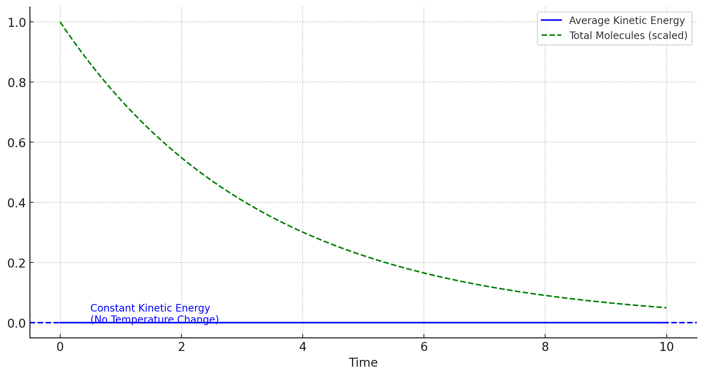{fig-alt="Illustration of Average Kinetic Energy and Total Molecules Over Time" width="80%"}

*Figure: Illustration of Average Kinetic Energy and Total Molecules Over Time.*

The graph is not drawn to scale, nor the curve is in the right shape, but it shows clearly that the internal temperature of the spaceship does not decrease due to air loss.

### Discharge Coefficient

The Discharge Coefficient ($C_d$) is a dimensionless number representing the ratio of actual to theoretical flow rates through an orifice or nozzle.\cite{lees-1996} Physicists have studied this topic for many decades but still need a conclusion. For common situations, it normally varies between 0.6 to 1.0.\cite{fahyan-2009} In our general model of leaking air, we can assume $C_d$ to be 0.9.

We will explore more about $C_d$ and its effect in the **Method** section.

## Theory

We use the basic laws of physics to derive equations useful to our specific situation.

### Ideal Gas Law

We consider the gas inside and outside the space station as ideal gas to make a good approximation. According to the ideal gas law, the equation is:

\[
PV=nRT
\]

Because the amount of substance of gas is equal to the mass of the gas $m$ divided by molar mass $M$, which is $n=\frac{m}{M}$. We then substitute it into $PV=nRT$:

\[
PV=\frac{mRT}{M}
\]

Rewritten, we get:

\[
m=\frac{MPV}{RT}
\]

Leading to:

\[
\rho=\frac{V}{m}=\frac{P}{RT}
\]

### Bernoulli's Principle

For compressible flow, Bernoulli's principle must be modified to consider changes in fluid density. The standard form of Bernoulli's equation for incompressible flow does not apply directly, as density (\(\rho\)) is not constant. For compressible flow, energy conservation can still be used, but it involves more advanced equations that consider changes in internal energy and pressure-volume work:

\[
\frac{P}{\rho} + \frac{1}{2} v^2 + h = \text{constant}
\]

Where \(h\) includes the internal energy term for compressible flow.

### Continuity Function

For compressible fluids, the continuity equation takes into account the changes in density:

\[
\frac{\partial (\rho A v)}{\partial x} = 0
\]

This equation states that the mass flow rate \(\rho A v\) must remain constant across the flow. In a steady flow, this simplifies to:

\[
\rho_1 A_1 v_1 = \rho_2 A_2 v_2
\]

### Properties of Fluid

According to Saad, 1985, fluids deform continuously when subjected to shearing forces. A fluid that shows a marked change of density with a change in pressure is compressible; one that shows a negligible change of density with a change in pressure is incompressible. The change of density of a single-component, single-phase fluid as a function of temperature and pressure may be expressed as:\cite{saad-1985}

\[
d\rho = \left( \frac{\partial \rho}{\partial T} \right)_p dT + \left( \frac{\partial \rho}{\partial p} \right)_T dp
\]

When divided by $\rho$, this becomes:

\[
\frac{d\rho}{\rho} = \frac{1}{\rho} \left( \frac{\partial \rho}{\partial T} \right)_p dT + \frac{1}{\rho} \left( \frac{\partial \rho}{\partial p} \right)_T dp
\]

Similarly, the relative change in volume can be expressed as:

\[
\frac{dv}{v} = \frac{1}{v} \left( \frac{\partial v}{\partial T} \right)_p dT + \frac{1}{v} \left( \frac{\partial v}{\partial p} \right)_T dp
\]

There are further studies on the compressibility of fluid flow. For our model, these equations are enough.

### Mass Flow Rate

In physics and engineering, the mass flow rate is the rate at which the mass of a substance changes over time. It can be expressed as:

\[
\dot{m} = \lim_{\Delta t \to 0} \frac{\Delta m}{\Delta t} = \frac{dm}{dt}
\]

Now we introduce the concept of the Adiabatic Index ($\gamma$). It determines how pressure, temperature, and volume relate to one another in an isentropic process. In this paper, $C$ refers to the relevant specific heat for air.

\[
\gamma=\frac{C_p}{C_v}
\]

When temperature and pressure changes are not large, values of the specific heats (and hence their ratio $\gamma$) are assumed to be constant. For air under moderate pressure and temperature:\cite{saad-1985}

\[
C_p = 1.0035 \, \text{kJ/kg K},\qquad
C_v = 0.7165 \, \text{kJ/kg K}
\]

Therefore:

\[
\gamma = 1.4
\]

The mass flow rate $\frac{dm}{dt}$ through a hole can be expressed as:

\[
\frac{dm}{dt} = C_d \cdot A \cdot P \cdot \sqrt{\frac{\gamma}{R \cdot T} \cdot \left( \frac{2}{\gamma + 1} \right)^{\frac{\gamma + 1}{\gamma - 1}}}
\]

This expression for mass flow rate can be simplified by grouping constants together. For air, the term:

\[
\sqrt{\frac{\gamma}{R \cdot T}} \left( \frac{2}{\gamma + 1} \right)^{\frac{\gamma + 1}{2(\gamma - 1)}}
\]

can be approximated to a simpler form, given as:

\[
\sqrt{\frac{M}{R \cdot T}}
\]

Therefore, we arrive at:

\[
\frac{dm}{dt} = -C_d A P \sqrt{\frac{M}{R T}}.
\]

## Method

### Model 1 — Specific Solution of Air

To derive a differential equation for the relationship between mass and pressure over time in a space station experiencing air leakage due to meteoroid damage, we use the ideal gas law and principles of fluid dynamics.

According to the ideal gas law modification, we have:

\[
m = \frac{PVM}{RT}
\]

This equation relates the mass $m$ of air inside the space station to the pressure $P(t)$.

As air escapes through the hole, the mass $m$ inside the space station decreases over time. The mass flow rate through a hole:

\[
\frac{dm}{dt} = -C_d A P \sqrt{\frac{M}{RT}}
\]

The negative sign indicates that the mass inside the space station is decreasing over time.

Substitute $m = \frac{PVM}{RT}$ into the differential equation for mass loss:

\[
\frac{d}{dt} \left(\frac{PVM}{RT}\right) = -C_d A P \sqrt{\frac{M}{RT}}
\]

We can then simplify this to:

\[
\frac{VM}{RT} \frac{dP}{dt} = -C_d A P \sqrt{\frac{M}{RT}}
\]

Rearrange to isolate $\frac{dP}{dt}$:

\[
\frac{dP}{dt} = -\frac{C_d A}{V} P \sqrt{\frac{RT}{M}}
\]

The differential equation is now:

\[
\frac{dP}{dt} = -kP
\]

where $k = \frac{C_d A}{V} \sqrt{\frac{RT}{M}}$ is a constant.

Separating variables and integrating:

\[
\int \frac{1}{P} \, dP = -k \int \, dt
\]

Solving the integrals gives:

\[
\ln P = -kt + C
\]

Exponentiate both sides and solve for $P$:

\[
P(t) = P_0 e^{-kt}
\]

Now, we can find the time $t$ it takes for the pressure to drop to 0.3 atmospheres by setting $P(t) = 0.3P_0$:

\[
0.3P_0 = P_0 e^{-kt}
\]

Simplifying:

\[
0.3 = e^{-kt}
\]

Taking the natural logarithm of both sides:

\[
\ln 0.3 = -kt
\]

Solving for $t$:

\[
t = -\frac{\ln 0.3}{k}
\]

Substitute $k = \frac{C_d A}{V} \sqrt{\frac{RT}{M}}$ to find $t$:

\[
t = -\frac{\ln 0.3 V}{C_d A} \sqrt{\frac{M}{RT}}
\]

### Model 2 — General Isentropic-Nozzle Solution

In a real-world situation, the behavior of air around the hole would be different significantly from place to place. In this model, we treat the hole as a "nozzle". Furthermore, we do not assume *temperature and pressure changes are not large* anymore. Instead, we take the adiabatic index ($\gamma$) into consideration.

The flow properties of perfect gas with constant specific heat can be related to Mach Number ($M$).

\[
M=\frac{v}{c}
\]

Static temperature and stagnation temperature are related as follows:\cite{saad-1985}

\[
\frac{T_0}{T} =  1 + \frac{\gamma - 1}{2} M^2
\]

When perfect gas flows isentropically, pressure and density are related to the temperature in the following ways, where $P_{out}$ and $\rho_{out}$ represent the pressure and density of space:

\[
\frac{P_0}{P_{out}}=(\frac{T_0}{T})^\frac{\gamma}{\gamma-1}
\]

and

\[
\frac{\rho_0}{\rho_{out}}=(\frac{T_0}{T})^\frac{1}{\gamma-1}
\]

Combine these relationships to get:\cite{saad-1985}

\[
\frac{P_0}{P_{out}} = \left( 1 + \frac{\gamma - 1}{2} M^2 \right)^{\gamma/(\gamma - 1)}
\]

and

\[
\frac{\rho_0}{\rho_{out}} = \left( 1 + \frac{\gamma - 1}{2} M^2 \right)^{1/(\gamma - 1)}
\]

And $M$ can be derived:

\[
M=\pm \sqrt{\frac{2}{\gamma - 1} \left[ \left( \frac{P_0}{P_{out}} \right)^{(\gamma - 1)/\gamma} - 1 \right]}
\]

We realize that $M$ is related to the pressure difference. In our case, the pressure of outer space is 0, which would lead our calculation to a mathematical failure. To avoid this, we examine what is the type of flow in and near the hole.

To identify whether the flow is subsonic or choked (sonic), we compare the actual pressure ratio to the critical pressure ratio for choked flow.

For air (with $\gamma = 1.4$):

\[
\left( \frac{P_2}{P_1} \right)_{\text{critical}} = \left( \frac{2}{\gamma + 1} \right)^{\gamma/(\gamma - 1)} \approx 0.528
\]

The actual pressure ratio is 0, so choked flow occurs and it is reasonable to proceed with $M=1$.\cite{saad-1985}

Looking back to our spaceship, the mass flow rate per unit area (mass flux) for the flow, $G$ is given by:

\[
G=\frac{\dot{m}}{A}=\rho v
\]

For perfect gas:

\[
\rho=\frac{P}{RT}
\]

and

\[
c=\sqrt{\gamma RT}
\]

Therefore:

\[
\frac{\dot{m}}{A} = \rho v M = P \left(\frac{v}{c}\right)\sqrt{\frac{\gamma}{RT_0}}
\]

Applying algebra (as in the original writeup), we land at:

\[
\dot{m}=m'(t) = -C_d A P(t) \sqrt{\gamma R T_0} \left( \frac{2}{\gamma + 1} \right)^{\frac{\gamma + 1}{2(\gamma - 1)}}
\]

and

\[
P(t)=\frac{T_0 m(t)}{MV}
\]

Then we simplify it into:

\[
\left\{
\begin{array}{ll}
m'(t) = -AkP(t), & k = C_d\sqrt{\gamma R T_0}\left( \frac{2}{\gamma + 1} \right)^{\frac{\gamma + 1}{2(\gamma - 1)}} \\
P(t)=\omega m(t), & \omega=\frac{T}{MV}
\end{array}
\right.
\]

If we are looking for the time when the pressure drops to 30\% of its initial value, set \( P(t) = 0.3 P_0 \):

\[
t = -\frac{\ln(0.3)}{A k \omega}
\]

Plugging in constants gives:

\[
t=-\frac{\ln(0.3)V}{C_d A} \sqrt{\frac{M}{RT}} \frac{1}{\sqrt{\gamma R T_0}\left(\frac{2}{\gamma+1}\right)^\frac{\gamma+1}{2(\gamma-1)}}
\]

### Discussion of Discharge Coefficient

From our resulting equations, we could see that $C_d$ has a huge impact on our computation of $P(t)$. There are lots of potential factors for $C_d$ in our case. We will explore three main properties that would increase the value of $C_d$ significantly.

#### Surface Roughness

The perimeter of the hole caused by the impact is rough. Physicists have long been interested in this property, and there is extensive research on how surface roughness affects the drag coefficient. We will not dig into the details, but it is a common conclusion that surface roughness can significantly influence the airflow behavior, generally increasing $C_d$.\cite{schlichting-1955}

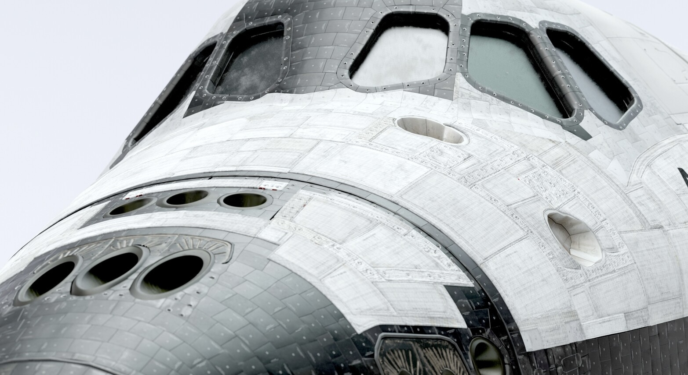{width="55%" fig-alt="Close Up Picture of Space Shuttle Atlantis"}

*Figure: Close Up Picture of Space Shuttle Atlantis\cite{Albin_Merle}.*

The outer surface of a spacecraft is designed with multiple layers of specialized materials, including metals such as aluminium alloys, titanium, and thermal protection tiles made of carbon or ceramic.\cite{Finckenor_Miria} Due to the composite structure and the necessity for protective coatings, the surface could be more perfectly smooth; it often exhibits micro-roughness from manufacturing joints, thermal shielding overlaps, and wear over time. When a meteoroid or asteroid impact occurs, the resulting hole is irregularly shaped and inherits the roughness of these layered materials.

#### Flow Regime

The irregularity of the hole would promote a turbulent flow rather than a laminar flow.

Laminar flow is characterized by orderly fluid motion with parallel layers and minimal energy loss, resulting in a lower $C_d$. In contrast, turbulent flow is chaotic, with eddies and vortices forming, leading to higher energy dissipation and an increased $C_d$.\cite{fahyan-2009}

High-pressure differences and fast-moving air escaping from the spacecraft contribute to a higher Reynolds number ($Re$), defined by:

\[
Re = \frac{\rho v D}{\mu}
\]

where $\rho$ is the density of the air, $v$ is the velocity of the escaping air, $D$ is a characteristic length, and $\mu$ is the dynamic viscosity of the air.

Some research has been done to evaluate the relationship between $C_d$ and $Re$. Generally, $C_d$ increases with the increase of $Re$.

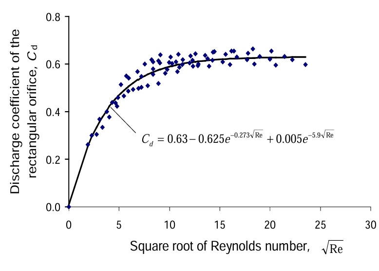{width="48%"}
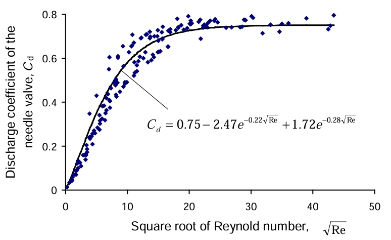{width="48%"}

*Figure: Relationship Between $C_d$ and $\sqrt{Re}$ \cite{wu-2002}.*

#### Angle of Attack (Irregular Entry Points)

The varied edges of the impact site can change how the air flows through the hole. Irregular entry and exit angles increase drag, making the air leakage less predictable and potentially faster.\cite{wu-2002}

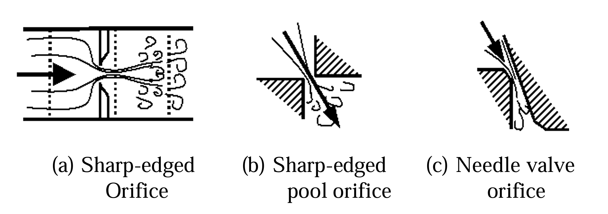{width="70%" fig-alt="Three Type of Orifice"}

*Figure: Three Type of Orifice \cite{wu-2002}.*

## Results and Interpretation

### Diameter and Time Relationship

For this instance, we estimated $C_d = 0.9$, and adjusting this value does not change the *relative* position of the data points. By running different values of hole diameter through our model, we can graph how different values affect the time it takes to reach 0.3 atmospheres.

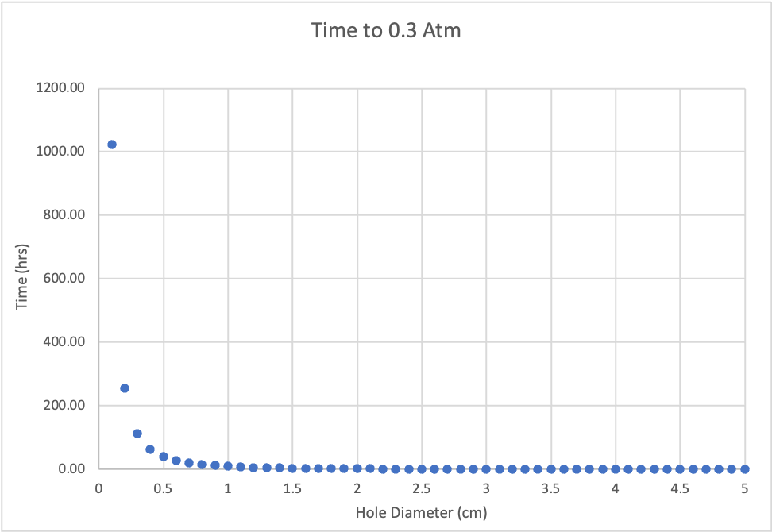{width="90%" fig-alt="Time to 0.3 atm vs diameter"}

*Figure: Time it takes to reach 0.3 Atmospheres for different hole diameters.*

The curve decays exponentially concerning the hole diameter, and holes smaller than 1 cm can take *thousands* of hours to decompress, dominating the curve. Instead, it is more helpful to chop off values that are under 1 cm.

{width="90%" fig-alt="Time to 0.3 atm vs diameter (cut)"}

*Figure: Same graph but without values under 1 cm.*

Here are some key points:

| Diameter | Time to 0.3 Atmospheres |
|---|---|
| 1 cm | 10.25 Hours |
| 3 cm | 1.14 Hours |
| 5 cm | 24.6 Minutes |

### Pressure Over Time

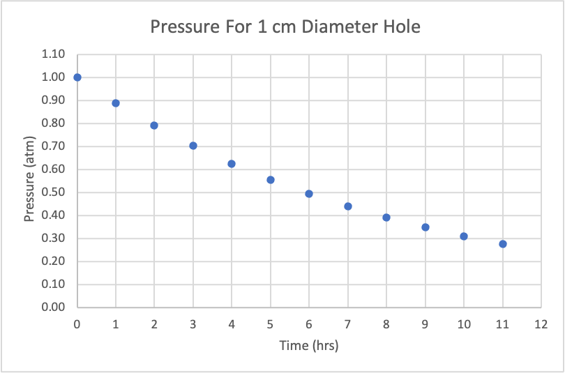{width="32%"}
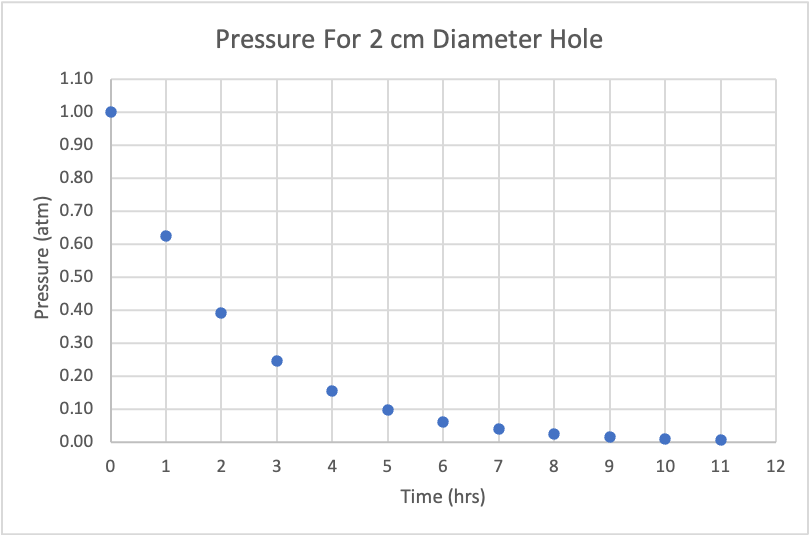{width="32%"}
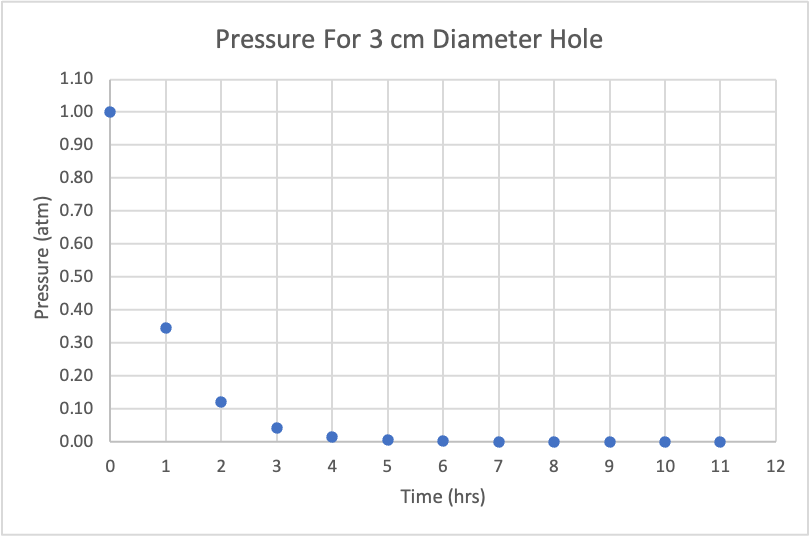{width="32%"}

*Figure: Pressure vs time for 1 cm, 2 cm, 3 cm holes.*

As the hole diameter increases, the rate at which air escapes the station increases dramatically.

### Discharge Coefficient and Time

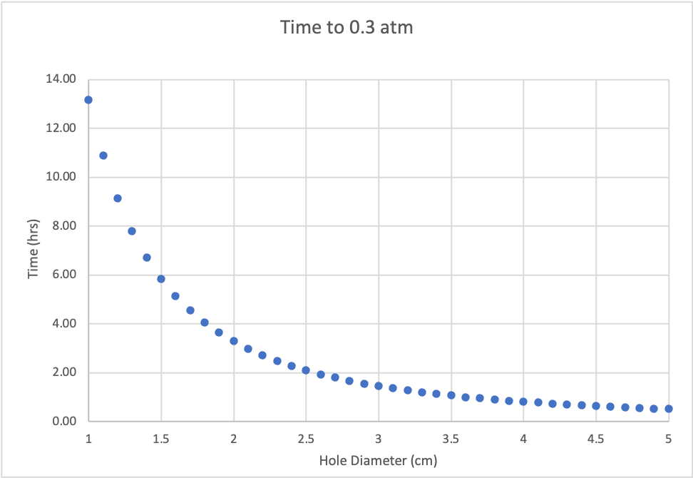{width="32%"}
{width="32%"}
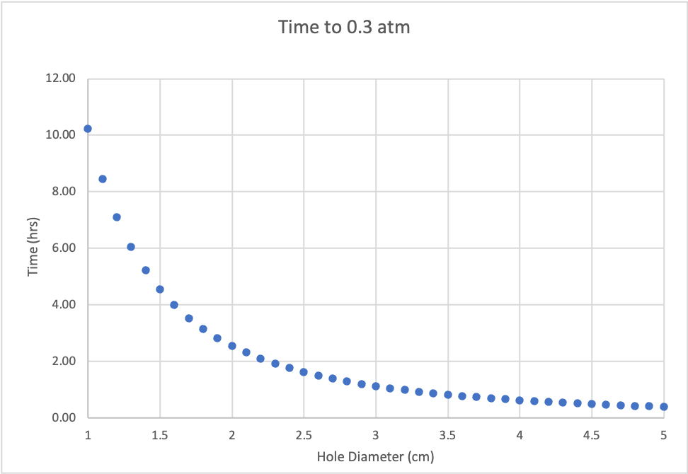{width="32%"}

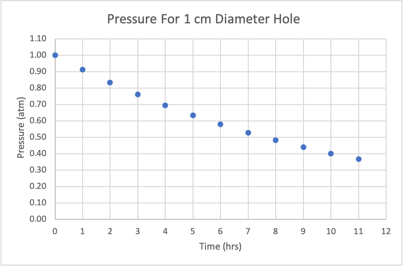{width="32%"}
{width="32%"}
{width="32%"}

*Figure: Comparing different $C_d$.*

It is hard to see with the naked eye but there is a difference. For three graphs of time to 0.3 atm, if the hole diameter increases from 1 cm to 1.5 cm, the time in the graph with $C_d=0.7$ decreases by approximately 7.2 hrs, higher than that of $C_d=0.8$ and $C_d=0.9$, which are approximately 6.6 hrs and 5.5 hrs respectively. Similarly, from the graphs of pressure for a 1 cm diameter hole, a lower $C_d$ results in a quicker decrease in pressure. A lower $C_d$ makes the curve steeper, meaning more pressure is lost in the first few hours.

## Discussion and Conclusion

### Comparing Model 1 and Model 2

If we take a close look at the two expressions, we will immediately notice that they share a lot of similarities:

\[
t = -\frac{\ln 0.3 V}{C_d A} \sqrt{\frac{M}{RT}}
\]

\[
t=-\frac{\ln(0.3)V}{C_d A} \sqrt{\frac{M}{RT}} \frac{1}{\sqrt{\gamma R T_0}\left(\frac{2}{\gamma+1}\right)^\frac{\gamma+1}{2(\gamma-1)}}
\]

The only difference is an additional term:

\[
\frac{1}{\sqrt{\gamma R T_0}\left(\frac{2}{\gamma+1}\right)^\frac{\gamma+1}{2(\gamma-1)}}
\]

We hypothesize that the actual function describing the leaking air is influenced by the specific heat of the fluid. However, further research is needed to verify this hypothesis.

### Limitations

#### Non-Zero Temperature and Pressure

{width="48%"}
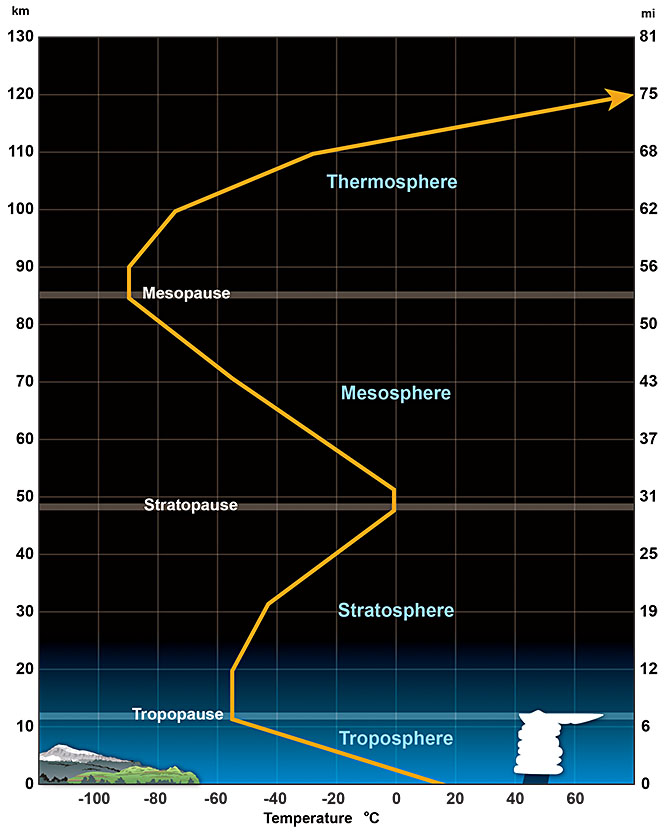{width="48%"}

*Figure: NOAA atmosphere layer figures \cite{noaa_layers}.*

We assume the space station is the International Space Station (ISS). The average altitude of its orbit is between 370 kilometer and 460 kilometer\cite{nasa_iss}. Between 85 kilometers and 600 kilometers lies the thermosphere, where the temperature increases sharply\cite{noaa_layers}. So, the temperature is affected by the altitude of the space orbit. However, during the modeling, we do not consider temperature changes.

#### Non-Isothermal

The leakage process in a real-world scenario cannot be considered purely adiabatic because some heat loss occurs due to heat transfer inside airflow.

Additionally, the outer shell of the spaceship is not perfectly isothermal. Any object with mass will conduct and transfer heat to some extent, influencing the overall temperature distribution. In practice, spaceships are equipped with various heating and thermal regulation systems to maintain a habitable environment for astronauts.

#### Non-Zero Acceleration

{width="35%" fig-alt="Watney uses air to fly in The Martian"}

*Figure: Watney uses air to fly in space in the movie* The Martian *\cite{weir2014martian}.*

The ejected airflow will impart a reactive force that accelerates the spaceship. This acceleration influences the distribution of air inside the spacecraft, potentially altering the pressure gradients.

### Conclusion

At the end of the day, we found that it takes 10 hours and 15 minutes for the pressure to drop to 0.3 atmospheres, and an increase in the hole's diameter leads to an exponential decrease in the time it takes.

In a harsh environment like the vacuum of space, it is critically important that everything goes smoothly. With the level of technology we are using to reach the beyond, there are so many failure points, that it seems ridiculous to even try. And yet the human spirit cannot help but be curious, and reach out in spite of the dangers. In situations like the one this paper explores, the astronauts and engineers need as much information as humanly possible to overcome these never-before-seen challenges. By doing this paper, and this competition, we have gotten a glimpse into the real-world problems these people face, and earned a new appreciation for the incredible work that humanities best can provide.

---

---

## Appendix

### Mathematica Code

```wolfram
ClearAll["Global`*"]

A = 3.14*0.01^2;
Cd = 1;
gamma = 1.4;
R = 8.3144;
V = 3.14*20*4^2;
M = 0.0289;
T = 20;
p = 1000;

k = A*Cd*
   Sqrt[gamma/(R*T)]*(2/(gamma + 1))^((gamma + 1)/(2*(gamma - 1)));

m0 = 10;
P0 = 1013; 
omega = P0/m0;

Print["k = ", k];
Print["omega = ", omega];

eq1 = D[m[t], t] == -A*k*P[t];
eq2 = P[t] == omega*m[t];

initialConditions = {m[0] == m0, P[0] == P0};

solution = DSolve[{eq1, eq2, initialConditions}, {m[t], P[t]}, t];

PSol = P[t] /. solution[[1]];

T30 = Solve[PSol == 0.3*P0, t];
T30Value = t /. T30[[1]];

Plot[{PSol, 0.3*P0}, {t, 0, 2*T30Value}, 
 PlotLegends -> {"P(t)", "30% of P(0)"}, 
 PlotLabel -> "Pressure P(t) Over Time", AxesLabel -> {"t", "P(t)"}, 
 PlotStyle -> {Red, {Dashed, Blue}}, 
 Epilog -> {Dashed, Line[{{T30Value, 0}, {T30Value, 0.3*P0}}], 
   Text["T30", {T30Value, 0}, {-1, 0}]}]

Graphics3D[{LightBlue, 
  GeometricTransformation[Cylinder[{{0, 0, 0}, {0, 50, 0}}, 2], 
   RotationTransform[Pi/2, {0, 1, 0}] ], Red, PointSize[Large], 
  Point[{0, 0, 0}] }, Boxed -> False, Axes -> True, 
 AxesLabel -> {"X", "Y", "Z"}, ViewPoint -> {2, -1, 2}, 
 Lighting -> "Neutral"]
